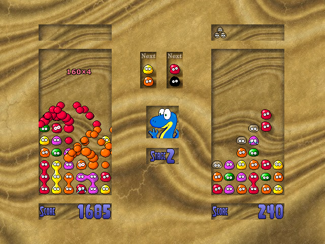

# Candy Crisis source port

This is an unofficial source port of the old Mac game “[Candy Crisis](https://candycrisis.sourceforge.net)” to modern macOS, Linux, and Windows. This version has an optional widescreen mode.

Get pre-built binaries here: https://github.com/jorio/CandyCrisis/releases

## How to build from source

See [BUILD.md](BUILD.md)

## Credits/license

- Original game: John Stiles
- Original artwork: Kate Davis, Leanne Stiles, Arnauld de la Grandiere, Bob Frasure, Ryan Bliss
- Music: Leanne Stiles, Lizardking, Armadon/Explizit, Leviathan/Nemesis, Jester/Pygmy, Siren, Sirrus, Scaven/FC, Spring, Timewalker, Jason/Silents, Chromatic Dragon, Ng Pei Sin

According to the [original project's homepage on SourceForge](https://sourceforge.net/projects/candycrisis), the source code is licensed under the GNU GPL 2.0. Therefore, my additions and modifications to the game's source code are also covered by the GNU GPL 2.0.

Artwork and music are copyrighted by their respective owners.

Third-party libraries:
- The audio mixer is a derivative work of [cmixer](https://github.com/rxi/cmixer), (C) 2017 rxi (MIT license)
- [ibxm/micromod](https://github.com/martincameron/micromod), (C) 2019 Martin Cameron (BSD-3-Clause license)
- [stb_image](https://github.com/nothings/stb), (C) 2017 Sean Barrett (MIT license)
- [SDL](https://github.com/libsdl-org/SDL), (C) 1997-2023 Sam Lantinga (zlib license)
